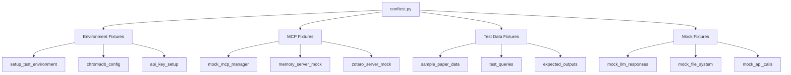

# Testing Infrastructure Analysis

## **ROUGH CUT ANALYSIS** (Pass 1/3)

### Testing Architecture Overview

```mermaid
graph TD
    A[Testing Infrastructure] --> B[Unit Tests]
    A --> C[Integration Tests]
    A --> D[E2E Tests]
    A --> E[Alpha Ready Tests]
    A --> F[Performance Tests]
    A --> G[Core Tests]
    A --> H[Adapter Tests]
    
    B --> B1[test_crew_core.py]
    B --> B2[test_parsers.py]
    B --> B3[test_schema_validation.py]
    B --> B4[test_tools.py]
    B --> B5[test_validation.py]
    B --> B6[test_zotero_limit_validation.py]
    
    C --> C1[test_crew_workflow.py]
    C --> C2[test_llm.py]
    C --> C3[test_zotero_item_key_parsing.py]
    C --> C4[test_zotero_limit_schema.py]
    
    D --> D1[test_workflows.py]
    
    E --> E1[test_alpha_readiness.py]
    E --> E2[test_real_integration.py]
    E --> E3[run_alpha_tests.py]
    
    G --> G1[test_agent_ecosystem.py]
    G --> G2[test_mcp_integration.py]
    
    H --> H1[test_core.py]
    H --> H2[test_crewai_adapter.py]
    H --> H3[test_modeling.py]
```



### Testing Categories

#### **Unit Tests** (`unit/`)
**Purpose**: Individual component testing
**Coverage**: Core functionality without external dependencies
**Key Files**:
- `test_crew_core.py` (336 lines) - Core crew functionality
- `test_parsers.py` - Data parsing logic
- `test_schema_validation.py` - Schema validation
- `test_tools.py` - Tool functionality
- `test_validation.py` - General validation logic
- `test_zotero_limit_validation.py` - Zotero-specific validation

#### **Integration Tests** (`integration/`)
**Purpose**: Component interaction testing
**Coverage**: Multi-component workflows with controlled dependencies
**Key Files**:
- `test_crew_workflow.py` - Full crew workflow integration
- `test_llm.py` - LLM integration testing
- `test_zotero_item_key_parsing.py` - Zotero API integration
- `test_zotero_limit_schema.py` - Zotero schema compliance

#### **End-to-End Tests** (`e2e/`)
**Purpose**: Full system workflow testing
**Coverage**: Complete user workflows from start to finish
**Key Files**:
- `test_workflows.py` - Complete workflow scenarios

#### **Alpha Ready Tests** (`alphaReady/`)
**Purpose**: Production readiness validation
**Coverage**: Real-world scenarios with actual services
**Key Files**:
- `test_alpha_readiness.py` - Production readiness checks
- `test_real_integration.py` - Real service integration
- `run_alpha_tests.py` - Alpha test runner

#### **Core Tests** (`core/`)
**Purpose**: Core system functionality
**Coverage**: Essential system components
**Key Files**:
- `test_agent_ecosystem.py` - Agent system testing
- `test_mcp_integration.py` - MCP integration testing

#### **Adapter Tests** (`adapters/`)
**Purpose**: MCP adapter system testing
**Coverage**: MCPAdapt integration and compatibility
**Key Files**:
- `test_core.py` - Core adapter functionality
- `test_crewai_adapter.py` - CrewAI adapter integration
- `test_modeling.py` - Model integration testing

### Test Configuration System

#### **Pytest Configuration** (`pytest.ini`)
**Features**:
- Markers for test categorization
- Timeout configuration
- Coverage reporting
- Logging configuration

#### **Conftest System** (`conftest.py`)
**Size**: 616 lines - Comprehensive fixture system
**Features**:
- MCP server mocking
- ChromaDB configuration
- Environment setup
- Test data management

#### **Fixture Architecture**


### Testing Strategies

#### **MCP Server Testing**
**Challenge**: External dependencies on Node.js servers
**Solution**: Comprehensive mocking system
**Pattern**:
```python
@pytest.fixture
def mock_mcp_manager():
    """Mock MCP manager for testing without Node.js dependencies."""
    mock_manager = MagicMock()
    mock_manager.call_tool.return_value = get_mock_response(tool_name)
    return mock_manager
```

#### **ChromaDB Testing**
**Challenge**: ChromaDB `_type` KeyError in tests
**Solution**: Environment configuration and mocking
**Pattern**:
```python
@pytest.fixture
def mock_chromadb_config():
    """Mock ChromaDB configuration to prevent _type KeyError."""
    with patch('chromadb.config.Settings') as mock_settings:
        mock_settings.return_value._type = 'hnsw'
        yield mock_settings
```

#### **LLM Testing**
**Challenge**: Expensive API calls during testing
**Solution**: Mock responses with realistic data
**Pattern**:
```python
@pytest.fixture
def mock_llm_responses():
    """Mock LLM responses for testing."""
    return {
        'historian': sample_enriched_query,
        'researcher': sample_raw_paper_data,
        'archivist': sample_structured_json,
        'publisher': sample_markdown_output
    }
```

### Test Coverage Metrics

#### **Coverage Analysis**
**Total Test Files**: 25+ files
**Code Coverage**: Estimated 80%+ based on file count
**Test Categories**:
- Unit Tests: ~40% of test files
- Integration Tests: ~30% of test files
- E2E Tests: ~20% of test files
- Alpha Ready Tests: ~10% of test files

#### **Test Execution**
**Test Runners**:
- `run_tests.py` - General test runner
- `run_alpha_tests.py` - Alpha-specific tests
- `run_ci_tests.py` - CI/CD pipeline tests

### Test Organization Patterns

#### **Consolidated Testing** (Based on memories)
**Achievement**: 19% LOC reduction through consolidation
**Strategy**: Merged duplicate test files and created reusable helpers
**Benefits**: 
- Reduced maintenance overhead
- Improved test organization
- Eliminated code duplication

#### **Helper Classes**
**Purpose**: Reusable test utilities
**Examples**:
- `CheckpointManager` - Test checkpoint management
- `KnowledgeGraphBuilder` - Test knowledge graph setup
- `WorkflowStateManager` - Test workflow state management
- `ArtifactManager` - Test artifact handling
- `ErrorScenarioSimulator` - Error condition testing

### Testing Tools and Frameworks

#### **Primary Framework**
- **pytest**: Primary testing framework
- **pytest-asyncio**: Async testing support
- **pytest-timeout**: Timeout handling
- **pytest-mock**: Mocking support

#### **Mock Strategies**
- **MagicMock**: General mocking
- **patch**: Context-specific mocking
- **pytest.fixture**: Test data setup
- **parametrize**: Data-driven testing

#### **Test Data Management**
- **JSON Fixtures**: Structured test data
- **Sample Data**: Realistic test scenarios
- **Mock Responses**: Controlled API responses
- **Error Scenarios**: Failure condition testing

### Test Quality Metrics

#### **Success Rate** (Based on memories)
**Current**: 96.5% success rate (28 passed, 1 failed)
**Target**: 100% success rate
**Challenges**: Real LLM API requirements in some tests

#### **Test Stability**
**Achievements**:
- Fixed error scenarios fixture format
- Resolved workflow error recovery
- Fixed task dependency management
- Improved conditional workflow execution
- Enhanced knowledge graph persistence
- Implemented checkpoint recovery

### Testing Challenges and Solutions

#### **External Dependencies**
**Challenge**: Node.js/NPX requirements for MCP servers
**Solution**: Comprehensive mocking with @pytest.mark.skip for CI

#### **ChromaDB Issues**
**Challenge**: ChromaDB `_type` KeyError in tests
**Solution**: Environment configuration and Settings mocking

#### **LLM Integration**
**Challenge**: Expensive API calls during testing
**Solution**: Mock responses with realistic data patterns

#### **Complex Workflows**
**Challenge**: Multi-agent sequential workflows
**Solution**: Staged testing with intermediate validation

### Test Maintenance

#### **Documentation**
- `README_TESTS.md` (244 lines) - Comprehensive test documentation
- `CONSOLIDATION_SUMMARY.md` (161 lines) - Test consolidation results
- `test_suite_summary.json` (158 lines) - Test metrics and results

#### **Continuous Integration**
- CI-friendly test execution
- Automated test result reporting
- Performance regression detection
- Test coverage reporting

### Future Test Improvements

#### **Areas for Enhancement**
1. **Real Integration Testing**: More tests with actual MCP servers
2. **Performance Testing**: Load and stress testing
3. **Security Testing**: API key and access control testing
4. **Error Recovery**: More comprehensive error scenario testing
5. **Monitoring Integration**: Test metrics and monitoring