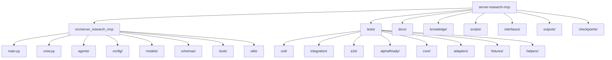

# Server Research MCP - Project Overview

## **ROUGH CUT ANALYSIS** (Pass 1/3)

### Project Structure Overview

### Core Architecture Pattern

This appears to be a **CrewAI-based research system** with **MCP (Model Context Protocol) integration**:

1. **Entry Points**: `main.py` (CLI) and `crew.py` (core orchestration)
2. **MCP Integration**: Heavy use of MCP tools for external service integration
3. **Research Pipeline**: Structured agent-based research workflow
4. **Schema-Driven**: Strong schema validation and structured outputs

### Key Components Identified

#### 1. **Core System** (`src/server_research_mcp/`)
- **Main Entry**: `main.py` (411 lines) - CLI interface
- **Crew Orchestration**: `crew.py` (528 lines) - Core workflow engine
- **Configuration**: YAML-based agent and task definitions

#### 2. **MCP Tool Integration** (`tools/`)
- **Enhanced MCP Manager**: `enhanced_mcp_manager.py` (971 lines) - Primary MCP interface
- **Tool Factory**: `tool_factory.py` (185 lines) - Dynamic tool creation
- **Base Tool**: `mcp_base_tool.py` (201 lines) - Tool foundation

#### 3. **Agent Configuration** (`config/`)
- **Agent Definitions**: `agents.yaml` (54 lines)
- **Task Definitions**: `tasks.yaml` (133 lines)
- **LLM Configuration**: `llm_config.py` (86 lines)

#### 4. **Data Models** (`schemas/`)
- **Research Paper**: `research_paper.py` (95 lines)
- **Obsidian Meta**: `obsidian_meta.py` (110 lines)

#### 5. **Testing Infrastructure** (`tests/`)
- **Comprehensive Coverage**: 25+ test files across unit/integration/e2e
- **MCP Integration Tests**: Specialized MCP testing framework
- **Performance Testing**: Dedicated performance test suite

### Technology Stack Identified

- **Framework**: CrewAI (agent orchestration)
- **Protocol**: MCP (Model Context Protocol)
- **Configuration**: YAML-based
- **Validation**: Pydantic/Schema-based
- **Testing**: pytest with extensive fixtures
- **Documentation**: Markdown with Mermaid diagrams

### Key Patterns Observed

1. **MCP-Centric Architecture**: Heavy reliance on MCP tools
2. **Schema-Driven Development**: Strong typing and validation
3. **Agent-Based Workflow**: CrewAI agent orchestration
4. **Extensive Testing**: Comprehensive test coverage
5. **Configuration-Driven**: YAML-based configuration management

### Next Analysis Steps

- **Fine Cut**: Detailed component analysis
- **Finishing Cut**: Code flow and interaction patterns
- **Pytest Analysis**: Test coverage and patterns