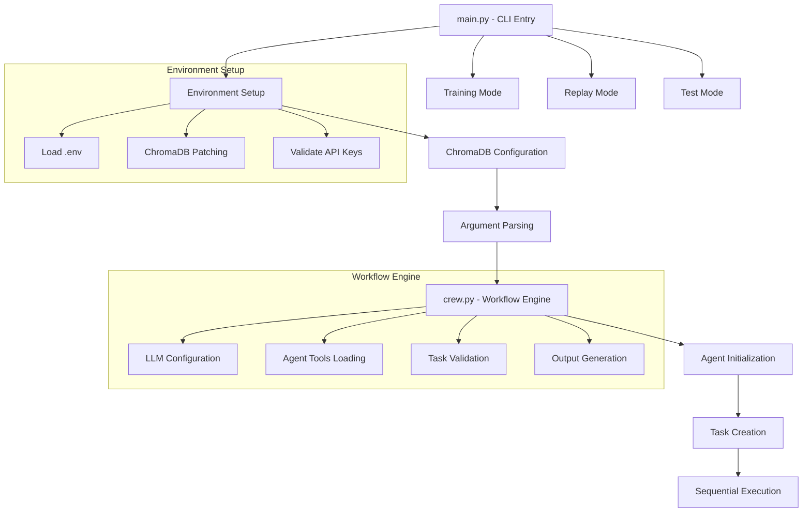
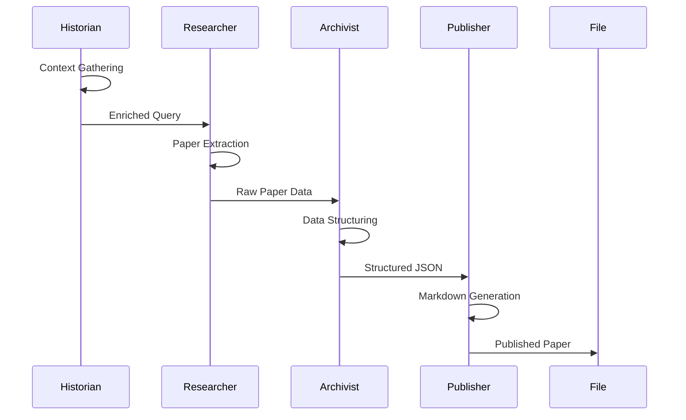

# Core Architecture Analysis

## **FINE CUT ANALYSIS** (Pass 2/3)

### System Entry Points

### Main System Components

#### 1. **Main Entry Point** (`main.py`)
**Purpose**: CLI interface and system bootstrap
**Key Features**:
- **Environment Management**: ChromaDB configuration and API key validation
- **Argument Parsing**: Flexible CLI with topic, year, output-dir options
- **Safety Features**: Dry-run mode, confirmation prompts
- **Multiple Modes**: Normal execution, training, replay, test

**Key Functions**:
- `setup_chromadb_environment()`: Configures ChromaDB to prevent `_type` KeyError
- `patch_chromadb_config()`: Runtime patching for ChromaDB compatibility
- `validate_environment()`: Ensures required API keys are present
- `run_crew()`: Main workflow execution

#### 2. **Crew Orchestration** (`crew.py`)
**Purpose**: Four-agent research workflow engine
**Architecture Pattern**: CrewAI Sequential Process

**Agent Flow**:

**Key Components**:
- **LLM Configuration**: Dynamic provider selection (Anthropic/OpenAI)
- **Tool Integration**: MCP tools loaded per agent
- **Task Validation**: Custom guardrails for each output type
- **Output Management**: Structured file outputs with validation

#### 3. **Agent Specifications**

##### **Historian Agent**
- **Role**: Memory and Context Manager
- **Tools**: Memory management tools (4 tools from memory server)
- **Output**: `enriched_query.json` with context and expanded search terms
- **Validation**: `validate_enriched_query()` - JSON structure validation

##### **Researcher Agent**
- **Role**: Paper Discovery and Content Extraction
- **Tools**: Zotero integration tools (3 tools)
- **Output**: `raw_paper_data.json` with metadata and full text
- **Validation**: `validate_raw_paper_data()` - Quality score validation

##### **Archivist Agent**
- **Role**: Data Structuring and Schema Compliance
- **Tools**: Sequential thinking tools (1 tool)
- **Output**: `structured_paper.json` with schema-compliant structure
- **Validation**: `validate_structured_json()` - Schema compliance

##### **Publisher Agent**
- **Role**: Markdown Generation and Vault Integration
- **Tools**: Filesystem tools (11 tools)
- **Output**: `published_paper.md` with Obsidian vault integration
- **Validation**: `validate_markdown_output()` - Frontmatter and structure

### Configuration System

#### **LLM Configuration**
- **Dynamic Provider Selection**: Based on `LLM_PROVIDER` environment variable
- **Anthropic Support**: Claude models with proper API key handling
- **OpenAI Support**: GPT models with fallback options
- **Context Window Management**: Respect context limits

#### **Environment Variables**
**Required**:
- `ANTHROPIC_API_KEY` or `OPENAI_API_KEY`
- `OBSIDIAN_VAULT_PATH`

**Optional**:
- `ZOTERO_API_KEY`, `ZOTERO_LIBRARY_ID`
- `LLM_PROVIDER`, `LLM_MODEL`
- `DISABLE_CREW_MEMORY`, `USE_ENHANCED_MCP`

### Error Handling and Robustness

#### **ChromaDB Compatibility**
- Runtime patching for `_type` KeyError prevention
- Environment variable configuration
- Memory disabling option for compatibility

#### **Validation System**
- **Multi-layered Validation**: JSON parsing, schema compliance, content quality
- **Retry Logic**: Up to 2 retries per task with progressive fallbacks
- **Graceful Degradation**: Minimal valid structures when validation fails

#### **Process Management**
- **Timeout Protection**: Server initialization timeouts
- **Resource Cleanup**: Proper process termination
- **Context Management**: Automatic resource management

### Performance Monitoring

#### **Metrics Collection**
- **Startup Time**: Server initialization duration
- **Task Performance**: Individual task execution times
- **Resource Usage**: Memory and CPU monitoring capabilities
- **Error Rates**: Validation failure tracking

#### **Logging System**
- **Structured Logging**: JSON-formatted logs with context
- **Debug Information**: Detailed parameter logging
- **Performance Metrics**: Timing and resource usage

### System Integration Points

#### **MCP Server Integration**
- **Enhanced MCP Manager**: Production-ready MCP integration
- **Schema Fixing**: Automatic schema issue resolution
- **Multi-server Support**: Memory, Context7, Zotero, Filesystem
- **Timeout Management**: Robust timeout handling

#### **Obsidian Integration**
- **Vault Path Management**: Configurable vault location
- **Frontmatter Generation**: YAML metadata structure
- **Note Creation**: Automatic note file creation

### Architecture Strengths

1. **Modular Design**: Clear separation of concerns
2. **Robust Error Handling**: Multiple fallback strategies
3. **Configuration-Driven**: Environment-based configuration
4. **Extensible**: Easy to add new agents and tools
5. **Production-Ready**: Comprehensive monitoring and logging

### Architecture Challenges

1. **ChromaDB Dependency**: Requires patching for compatibility
2. **MCP Server Complexity**: Multiple external dependencies
3. **Validation Complexity**: Complex validation logic
4. **Resource Management**: Multiple concurrent processes