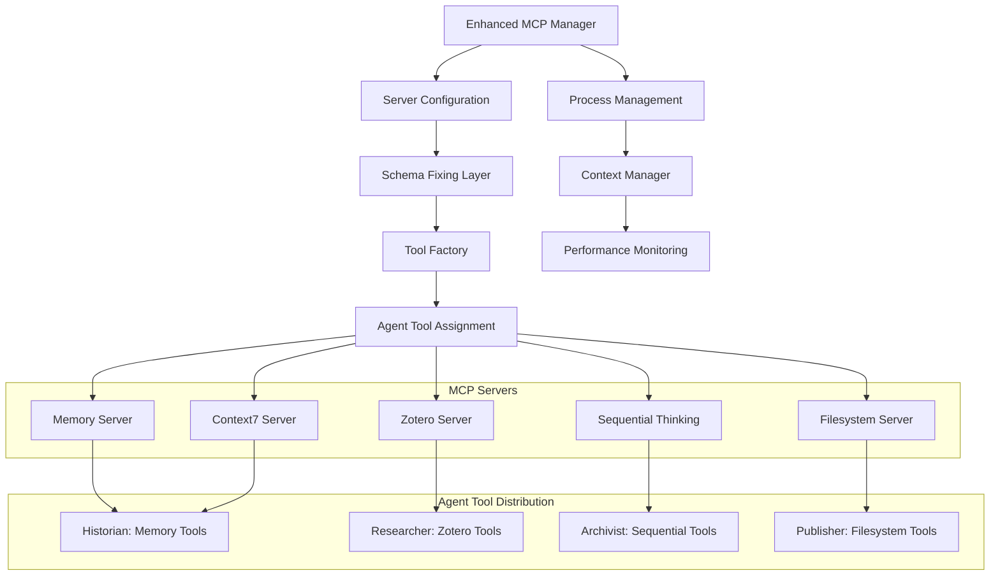
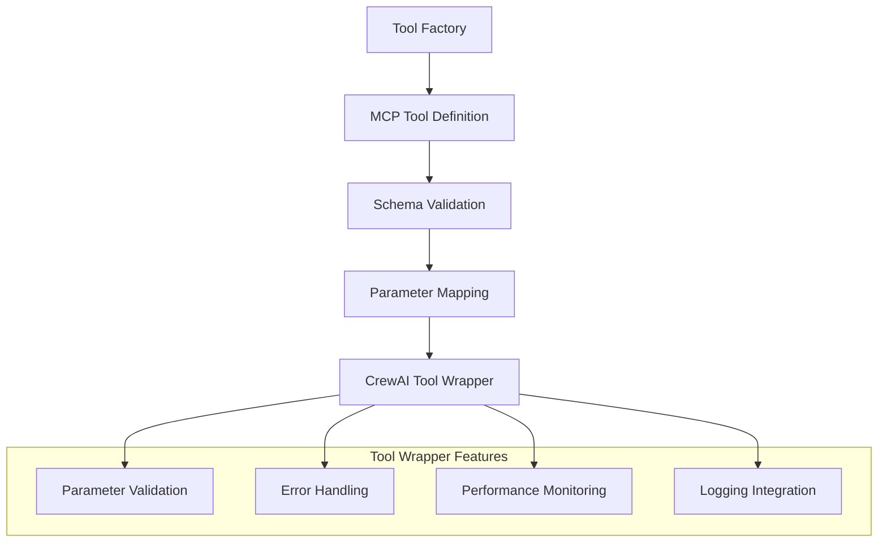
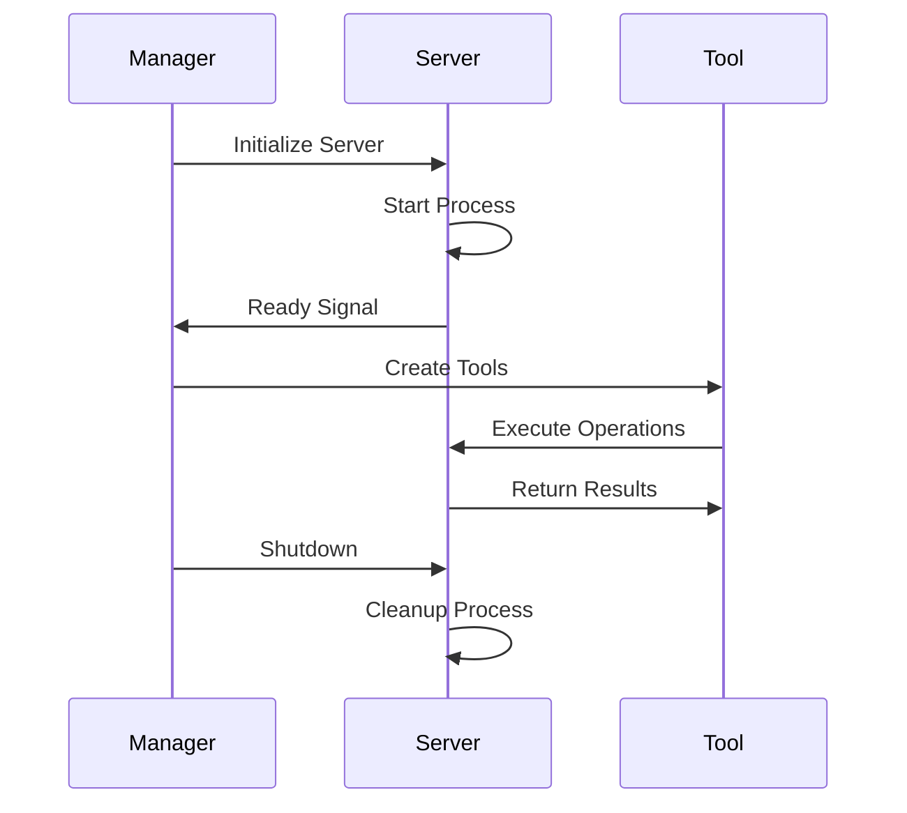

# MCP Tools Architecture Analysis

## **FINE CUT ANALYSIS** (Pass 2/3)

### MCP Integration Architecture



### Enhanced MCP Manager (`enhanced_mcp_manager.py`)

#### **Core Architecture**
**Purpose**: Production-ready MCP server integration with comprehensive error handling
**Key Features**:
- **Schema Fixing**: Automatic resolution of MCP schema incompatibilities
- **Context Management**: Proper server lifecycle management
- **Performance Monitoring**: Detailed metrics and logging
- **Timeout Protection**: Robust timeout handling for all operations

#### **Schema Fixing System**
**Problem**: MCP servers often have schema issues that cause Union[tuple([])] errors
**Solution**: `fix_schema_anyof_const_issue()` function

```python
# Pattern Detection and Fix
anyOf: [{"const": "value1"}, {"const": "value2"}]
# Converted to:
{"type": "string", "enum": ["value1", "value2"]}
```

**Benefits**:
- Automatic schema normalization
- Prevents CrewAI tool creation failures
- Maintains compatibility with MCP protocol

#### **Server-Specific Handling**

##### **Memory Server Integration**
- **Tools**: `search_nodes`, `create_entities`, `add_observations`, `delete_observations`
- **Known Issues**: `toLowerCase()` undefined bug in search_nodes
- **Workaround**: Fallback queries and parameter validation
- **Initialization**: Empty graph setup with validation

##### **Context7 Server Integration**
- **Tools**: `resolve-library-id`, `get-library-docs`
- **API Pattern**: Library resolution followed by documentation retrieval
- **Error Handling**: Specific error messages for common issues
- **Timeout Management**: Network-aware timeout handling

##### **Zotero Server Integration**
- **Tools**: `zotero_search`, `zotero_item_metadata`, `zotero_collections`
- **Parameter Validation**: String coercion for limit parameters
- **API Key Management**: Secure key handling
- **Rate Limiting**: Respectful API usage patterns

##### **Filesystem Server Integration**
- **Tools**: 11 filesystem operations (read, write, list, etc.)
- **Security**: Path validation and sandboxing
- **Performance**: Efficient file operations
- **Error Handling**: Comprehensive file system error management

##### **Sequential Thinking Server**
- **Tools**: Multi-step reasoning support
- **Integration**: Complex analysis workflows
- **Context Management**: Maintains reasoning state

### Tool Factory System (`tool_factory.py`)

#### **Dynamic Tool Creation**


#### **Tool Distribution Strategy**
- **Historian**: Memory tools + Context7 (4 tools total)
- **Researcher**: Zotero tools (3 tools total)
- **Archivist**: Sequential thinking tools (1 tool total)
- **Publisher**: Filesystem tools (11 tools total)

### Base Tool System (`mcp_base_tool.py`)

#### **Common Tool Interface**
**Purpose**: Standardized tool interface for all MCP tools
**Key Features**:
- **Consistent Error Handling**: Unified error patterns
- **Parameter Validation**: Type checking and sanitization
- **Performance Monitoring**: Execution time tracking
- **Logging Integration**: Structured logging for debugging

#### **Tool Wrapper Pattern**
```python
class MCPBaseTool:
    def __init__(self, server_name, tool_name, schema):
        self.server_name = server_name
        self.tool_name = tool_name
        self.schema = schema
        
    def execute(self, **kwargs):
        # Validate parameters
        # Call MCP server
        # Handle errors
        # Return result
```

### Context Management System

#### **Server Lifecycle Management**


#### **Context Manager Pattern**
```python
with enhanced_mcp_manager.server_connection('memory') as tools:
    result = tools.search_nodes(query="research")
    # Server automatically cleaned up
```

### Performance Monitoring

#### **Metrics Collection**
- **Startup Time**: Server initialization duration
- **Tool Execution Time**: Individual tool performance
- **Error Rates**: Failure tracking by server and tool
- **Resource Usage**: Memory and CPU monitoring

#### **Health Check System**
- **Server Availability**: Periodic health checks
- **Tool Functionality**: Validation of tool responses
- **Performance Degradation**: Alert on performance issues
- **Automatic Recovery**: Restart failed servers

### Error Handling Strategies

#### **MCP-Level Errors**
- **Schema Issues**: Automatic schema fixing
- **Server Crashes**: Automatic restart with backoff
- **Network Issues**: Retry with exponential backoff
- **Timeout Errors**: Graceful timeout handling

#### **Application-Level Errors**
- **Parameter Validation**: Type checking and sanitization
- **Result Validation**: Output format verification
- **Fallback Strategies**: Alternative approaches on failure
- **User-Friendly Messages**: Clear error descriptions

### Integration Patterns

#### **Agent-Tool Mapping**
```python
def get_historian_tools():
    return [
        memory_search_tool,
        memory_create_tool,
        memory_observe_tool,
        context7_resolve_tool
    ]
```

#### **Tool Configuration**
```python
TOOL_CONFIG = {
    'memory': {
        'timeout': 30,
        'retries': 3,
        'fallback_strategy': 'empty_result'
    },
    'zotero': {
        'timeout': 45,
        'retries': 2,
        'rate_limit': '100/hour'
    }
}
```

### Development and Testing

#### **Mock MCP Responses**
- **Testing Mode**: Mock responses for CI/CD
- **Development Mode**: Real MCP servers for development
- **Hybrid Mode**: Mix of real and mock for specific scenarios

#### **Tool Validation**
- **Schema Validation**: Ensure tools meet CrewAI requirements
- **Integration Testing**: Full workflow testing
- **Performance Testing**: Load and stress testing

### Security Considerations

#### **API Key Management**
- **Environment Variables**: Secure storage of API keys
- **Key Rotation**: Support for key rotation
- **Access Control**: Scoped access to resources

#### **Process Security**
- **Sandboxing**: Isolated server processes
- **Resource Limits**: CPU and memory limits
- **Network Security**: Controlled network access

### Architecture Benefits

1. **Robustness**: Comprehensive error handling
2. **Performance**: Optimized for production use
3. **Scalability**: Easy to add new MCP servers
4. **Maintainability**: Clear separation of concerns
5. **Debugging**: Extensive logging and monitoring

### Architecture Challenges

1. **Complexity**: Multiple server coordination
2. **Dependencies**: External server dependencies
3. **Debugging**: Complex error chains
4. **Performance**: Multiple server latency